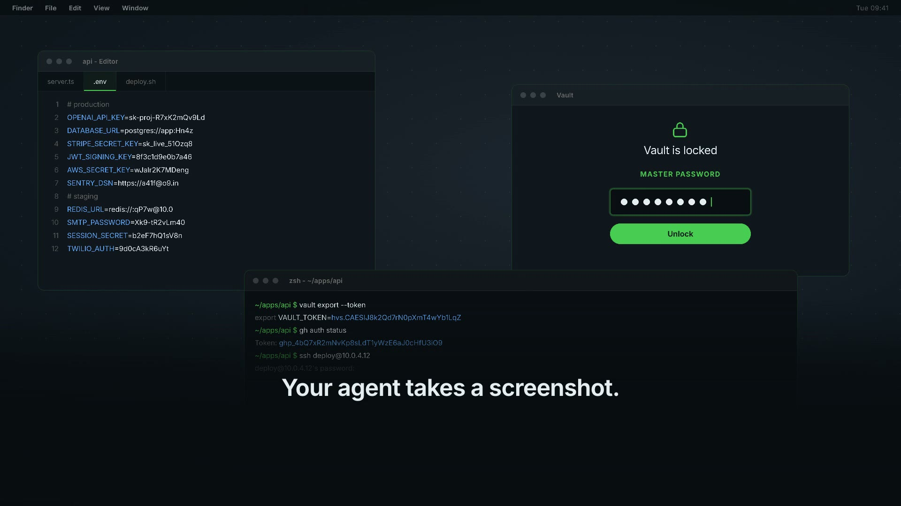

# Computer MCP



**Computer use you can actually leave running.**

A macOS computer-use MCP server with the guardrails on by default. Password
fields are blacked out while the screenshot is still in memory. Nothing clicks
or types until a human says yes. Every call is written to an append-only log.

No account, no API key, no model inside it. MIT.

```bash
npx @agent360/computer-mcp
```

No Swift needed: the package ships a universal binary for Apple silicon
and Intel. It carries the ad-hoc signature macOS needs to run it at all -
not a Developer ID signature, and not notarized. Gatekeeper may therefore
ask you the first time.

[computermcp.dev](https://computermcp.dev) · [Security model](https://computermcp.dev/security.html)

---

## Why

Handing an agent your keyboard, mouse and screen is the most useful thing you
can give it and the least reversible. A screenshot of a working developer's Mac
can contain a password manager mid-unlock, a `.env` open in the editor, or
customer data. A stray keystroke in a terminal is not a typo - it is a command.

Most desktop-automation MCP servers hand all of that over at once, with no way
to say *that, but not that*. So the careful people don't run them on the machine
where the work actually is.

This is the same capability with the dangerous edges answered.

## The three gates

**1. Passwords never reach the model.** Secure text fields and password-manager
windows are painted opaque black on the bitmap *in memory*, before the PNG is
written. There is no moment where an unredacted picture of your desktop exists
as a file. Native fields expose the role `AXSecureTextField`; fields in a web
page expose role `AXTextField` with the *subrole* `AXSecureTextField`. Checking
only the role would catch native fields and let every browser password box
through - so both are checked.

**2. Nothing clicks until you say yes.** The first write action opens a real
macOS dialog naming what is about to happen. Password managers and terminals ask
*every single time*, even after the session was approved, even in `allow` mode -
that one is not configurable. If nobody answers the dialog, the answer is no.

**3. Everything is written down.** `~/.local/state/computer-mcp/audit.jsonl`,
mode `0600`, append-only: every call, its target app, and whether it was allowed
or refused with the reason. Typed text is stored as a length and a *salted*
SHA-256 prefix, never in clear - an audit trail full of passwords is its own
breach. The salt is random per run and never written down, because an unsalted
hash of a short password can be guessed offline by whoever holds the log. The
honest cost: two actions can be compared within one run, not across runs.

Each gate has a test, and each test has been mutation-checked: break the code on
purpose and the test goes red. See [Testing](#testing).

## Install

```bash
# Claude Code
claude mcp add computer -- npx -y @agent360/computer-mcp
```

```jsonc
// Cursor, VS Code, Codex CLI, Windsurf - mcp.json
{
  "mcpServers": {
    "computer": { "command": "npx", "args": ["-y", "@agent360/computer-mcp"] }
  }
}
```

Then grant two macOS permissions: **System Settings → Privacy & Security →
Accessibility**, and the same under **Screen Recording**. Ask your agent to call
`computer_permissions` and it will tell you what is still missing.

**Which app do you grant them to?** macOS attributes these to the *responsible
process*, and which process that is depends on how you launched the server. Run
from a terminal, it is usually the terminal. Run by an MCP client over `npx`, it
may be the client instead. The honest answer is: grant it to whichever app the
system dialog names, and if no dialog appears, start with the app that launched
the client and check `computer_permissions` again.

> **Untested, and we would rather say so:** we have not yet measured this from a
> clean machine with permissions reset, so we cannot tell you with certainty
> which of the two it will be in your setup, nor whether upgrading the package
> re-prompts. The helper is ad-hoc signed, which means its code identity changes
> with every build - if macOS keys your grant to the helper rather than to the
> host app, an upgrade could silently revoke it.
> [Issue #4](https://github.com/Agent360dk/computerMCP/issues) tracks the
> measurement. If you hit either behaviour, telling us what you saw is a real
> contribution.

## Modes

| `CMCP_MODE` | Behaviour |
|---|---|
| `readonly` | Write tools are not even listed. The agent can look and cannot touch. |
| `ask` | **Default.** One dialog grants the session. Dangerous apps still ask every time. |
| `allow` | Writes proceed without asking, still logged. Dangerous apps *still* ask. |

`CMCP_ASK_TIMEOUT` (seconds, default 60) controls how long a dialog waits before
it refuses.

## Tools

> **The repo is ahead of npm.** This source exposes **27 tools, 11 of them
> read-only**. `npx @agent360/computer-mcp` still serves 0.1.0, which has 12 and
> is missing `find`, `press`, `wait_for`, `focused`, `set_value` and `ask_user`.
> Build from source until 0.2.0 ships.

**Look:** `computer_screenshot` · `computer_inspect` · `computer_find` ·
`computer_wait_for` · `computer_focused` · `computer_apps` · `computer_windows` ·
`computer_permissions` · `computer_displays` · `computer_menus` · `computer_audit`

**Touch:** `computer_launch` · `computer_quit` · `computer_paste` · `computer_window` · `computer_space` · `computer_menu` · `computer_press` · `computer_set_value` · `computer_ask_user` ·
`computer_click` · `computer_drag` · `computer_type` · `computer_key` · `computer_scroll` ·
`computer_move` · `computer_activate`

**`computer_ask_user` is the one that cannot carry a secret.** It returns true
or false, never text. The agent puts the cursor in the field, the dialog names
the app and the window it is about to land in - written by the server, not by
the model - and you type on your own keyboard. There is deliberately no route
through this server for a password to reach a model.

**`computer_set_value`** writes into a field behind another window without
moving your pointer, and refuses on a secure field every time. We removed that
check on purpose once: the modified build wrote into the password box. It is the
only thing standing there.

**`computer_wait_for`** waits for an element to appear instead of taking
screenshots in a loop. Twenty polls cost one call here and twenty images the
other way.

`computer_inspect` reads the accessibility tree - roles, titles, values, frames -
so the agent can click a button by knowing where it is instead of guessing from
pixels. `computer_find` narrows that to the elements matching a role, a title or
a substring. Values of secure fields are never returned, not even to the agent.

**Deliberately absent:** no shell execution, no arbitrary file access, no URL
fetching. Each would be one line of code. A computer-control server with a shell
inside it is remote access under a friendlier name. If you want a shell, install
a shell MCP server - then you have chosen it, and the choice is visible in your
config.

## Without taking over your screen

`computer_click` and `computer_type` go through the system's own input tap, so
they land wherever the keyboard focus is and they move your real pointer. That
is fine when you are watching. It is not fine when you are working in another
window.

`computer_press` takes the other route: it fires the element's *own*
accessibility action. That works while the window is behind another one, and it
moves nothing on your screen. `computer_find` is how the agent locates the
element to press.

```jsonc
computer_find  { "app": "com.apple.Safari", "role": "AXButton", "contains": "Log in" }
computer_press { "app": "com.apple.Safari", "contains": "Log in" }
```

Two or more matches is a refusal, not a guess - the agent gets the candidates
and has to narrow it down, because pressing the first plausible button is
exactly the kind of almost-right action nobody notices afterwards.

The consent dialog still comes to the front, and the apps on the always-ask list
still ask every time. `computer_press` names its target app, and that name is
what the gate judges - so pressing something in 1Password asks even when
1Password is nowhere near the front.

**Several agents at once.** Each MCP client starts its own server, so a second
chat is just a second process. They share one audit log, and every line carries
a per-server `session` mark - set `CMCP_CLIENT=<name>` and the line carries that
too, so the log answers *which* conversation clicked. Fifty interleaved writes
from two servers, zero torn lines: `test/concurrent.mjs`.

What is **not** solved yet: two servers pressing at the same time still share
one pointer and one focused window, and there is no lock between them. Use
`computer_press` for the background work, and keep the coordinate tools for the
session you are actually watching.

## What it does not do

- **macOS only** (14+). No Windows or Linux build, and none planned.
- **Only what macOS marks as secure is redacted.** A password in a plain text
  editor or a token in a terminal buffer is not marked and will not be hidden.
  Use `readonly` when the screen holds something the system cannot know about.
- **Consent is not containment.** After you approve, the agent drives your real
  Mac - that is what you approved. If you need a boundary rather than a
  decision, run it in a VM. That is the honest answer, not a missing feature.
- **Prompt injection stays possible.** The dialogs and the log make it visible
  rather than silent. They do not make it impossible.

## Building from source

```bash
git clone https://github.com/Agent360dk/computerMCP
cd computerMCP/helper && swift build -c release     # the privileged binary
cd ../mcp-server && npm install
CMCP_MODE=readonly node index.js
```

The helper is a separate Swift binary with **zero third-party dependencies**.
It is the part that *uses* Accessibility and Screen Recording, it is small
enough to read in one sitting, and it can be replaced without touching the
server. (Which process macOS *grants* those permissions to is a separate
question, and an open one - see the note under Install.) Every package inside a binary that privileged is a vendor
you are trusting without having chosen to.

## Testing

```bash
./test/run-all.sh                # everything, full output kept in a log

python3 test/redaction-unit.py   # the four redaction checks
node test/server-e2e.mjs         # the MCP protocol, read paths, readonly refusal
node test/failclosed.mjs         # an unanswered dialog must refuse
node test/claims.mjs             # every claim this README makes
node test/concurrent.mjs         # two servers at once: no torn lines, both identifiable
./test/redaction-proof.sh        # live secure-field detection (needs a normal desktop)
```

`claims.mjs` checks the sentences on the front page against the code: that a
terminal still asks in `allow` mode, that a harmless app does *not* (otherwise
"refuse everything" would pass), that typed text reaches the log only as a
length and a hash, and that no shell, file or URL tool has appeared.

Where a check cannot be made meaningfully - no secure field happens to be on
screen - it reports SKIPPED, not passed. A green suite that measured nothing is
the failure mode these tests exist to avoid.

`redaction-unit.py` builds its own image instead of measuring the live screen.
The first version measured the real desktop - and on a machine where the editor
runs full-screen the test window could not appear at all, so the test measured
an empty screenshot and called it a pass. A security test that passes when it
cannot see anything is worse than no test.

`redaction-proof.sh` still exercises the live path and needs a desktop that is
not in full-screen mode. It fails loudly rather than skipping quietly.

## Help build it

The redaction list holds the password managers we thought of. It does not hold
your banking app, your company's secrets manager, or whatever is popular where
you live. **One team cannot write that list; many people adding one line each
can** - and every app someone contributes makes the tool safer for everyone who
installs it afterwards.

That takes [an issue form](https://github.com/Agent360dk/computerMCP/issues/new/choose)
and no code. So does writing down how some Mac app actually behaves, which is
knowledge that currently only exists in the heads of people who already fought it.

[The wishlist](WISHLIST.md) is the rest: open items, sized honestly, none of them
assigned. [How contributing works](CONTRIBUTING.md).

## Who makes this

Built by **[Agent360](https://agent360.dk)**, a Danish shop building agents that
do real work:

- **[Browser MCP](https://browsermcp.dev)** - the same idea for a real,
  logged-in Chrome. Written alongside this one, and the two share their lessons.
- **[JesperAI](https://jesperai.com)** - voice agents that hold an actual
  conversation on the phone.
- **[ForbrugerAgenten](https://forbrugeragenten.dk)** - an agent that reads your
  household bills and switches your provider for you.

Everything here is MIT and runs on your machine. None of the above is required,
bundled, or phoned home to.

## Licence

MIT © Agent360 Group ApS.
